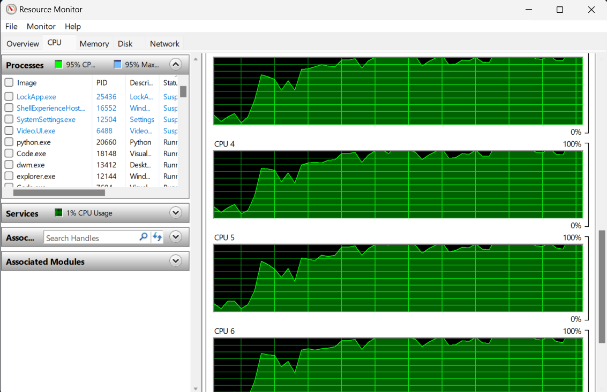

# Multi-Threading

This assignment demonstrates matrix multiplication using Multithreading in Python.

## Problem Statement

The task is to multiply 100 random matrices of size 1000x1000 with a constant matrix of the same size using multithreading.

## Multithreading Overview

Multithreading allows concurrent execution of tasks within the same process. Threads share the same memory space and can run independently, leveraging multiple CPU cores for parallel computation.

## Prerequisites

1. Python 3.x
2. NumPy
3. Matplotlib
4. Pandas

The script will generate the following outputs: - Table showing the time taken for matrix multiplication with different numbers of threads. - Graph plotting the matrix multiplication time versus the number of threads. - CPU usages (if available). - Graph of CPU usage with percentage 0 to 100 percent

## Results Interpretation

1. **Time Taken**: Refers to the duration it takes to perform a specific operation or task. In this context, it represents the time taken to perform matrix multiplication.

2. **CPU Usage**: Represents the percentage of CPU (Central Processing Unit) capacity utilized by the system at a given moment. It indicates how much of the CPU's processing power is being used.

3. **Number of Threads**: Refers to the number of concurrent execution units within a process. In this code, it indicates the number of threads used for performing matrix multiplication in parallel. Increasing the number of threads can potentially improve performance by utilizing multiple CPU cores concurrently.

## Results

### Number of Threads vs. Total Time

| Number of Threads | Total Time (seconds) |
|-------------------|----------------------|
| 1                 | 2.126                |
| 2                 | 2.035                |
| 3                 | 2.020                |
| 4                 | 1.978                |
| 5                 | 2.052                |
| 6                 | 2.115                |
| 7                 | 2.102                |
| 8                 | 2.249                |
| 9                 | 2.719                |
| 10                | 3.271                |
| 11                | 3.611                |
| 12                | 3.756                |
| 13                | 3.762                |
| 14                | 3.782                |
| 15                | 3.802                |
| 16                | 4.056                |

### Graph

The graph illustrates how the total time taken for matrix multiplication decreases as the number of threads increases due to parallelism.

### CPU Usage

The CPU usage graph shows the utilization during the execution of the multithreading program, demonstrating the effectiveness of multithreading in leveraging CPU resources.
